# Hello, folks! 

## Tech Stack

  
  
  
  
  
  
  
  
  
  
  
  
  
  
  
  

## GitHub Stats

_NOTE: The "Top Languages" metric reflects the volume of code I have on GitHub, rather than my overall proficiency or skill level in these languages._

<!-- links to social media icons -->

<!-- Resources -->
<!-- Icons: https://simpleicons.org/ -->
<!-- GitHub Stats: https://github.com/anuraghazra/github-readme-stats -->
<!-- Emojis: https://emojipedia.org/emoji/ -->
<!-- HTML Emojis: https://www.fileformat.info/index.htm -->
<!-- Shields: https://shields.io/ -->
<!-- Awesome GitHub Profile README: https://github.com/abhisheknaiidu/awesome-github-profile-readme -->

## Where to find me

  

